<p align="center">
  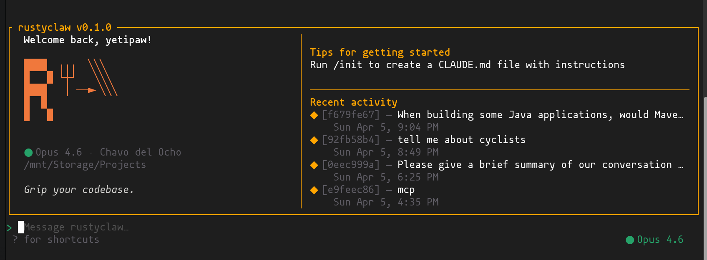
</p>

<h3 align="center">Grip your codebase.</h3>

<p align="center">
  Rust-native AI coding CLI · Single binary · No runtime · ~10ms startup
</p>

<p align="center">
  <a href="https://github.com/ForkedInTime/RustyClaw/releases"></a>
  <a href="https://github.com/ForkedInTime/RustyClaw/actions/workflows/ci.yml"></a>
  <a href="LICENSE"></a>
  <a href="https://www.rust-lang.org"></a>
</p>

---

## What it looks like

<table>
<tr>
<td width="50%">

**Coding conversation — streaming**
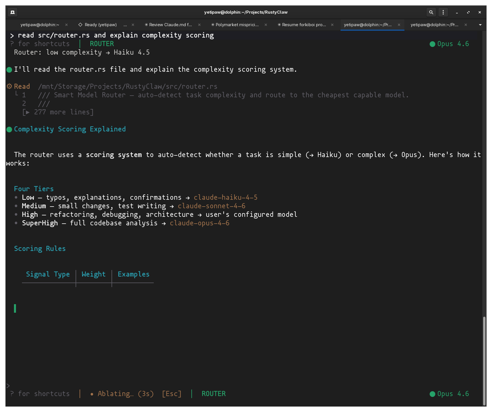

</td>
<td width="50%">

**Completed response with cost tracking**
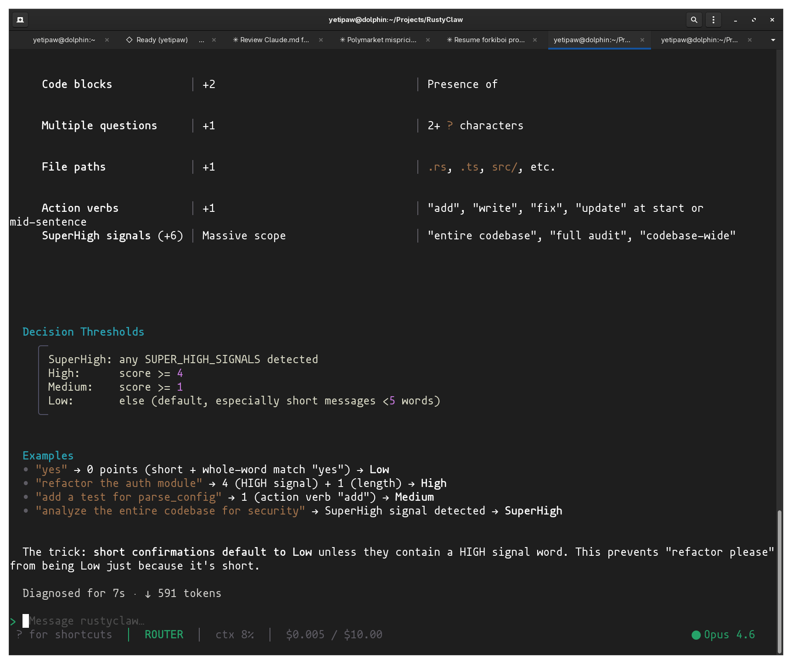

</td>
</tr>
<tr>
<td width="50%">

**Codebase RAG search**
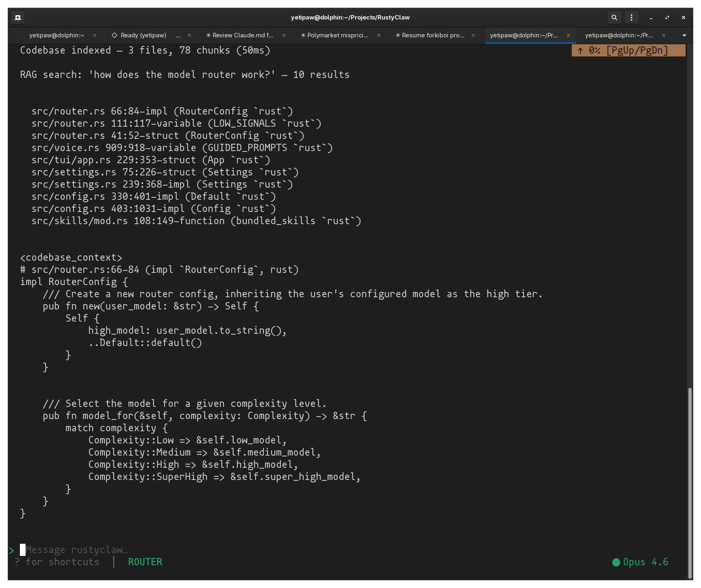

</td>
<td width="50%">

**Model picker — Claude + Ollama**
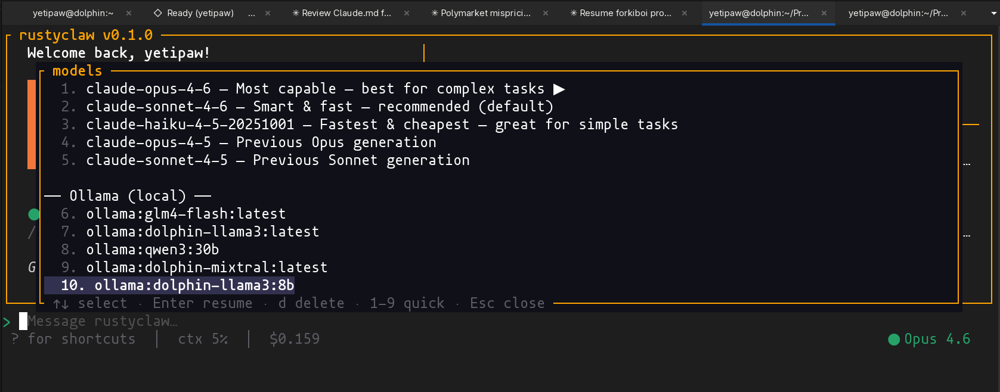

</td>
</tr>
<tr>
<td width="50%">

**Session manager**
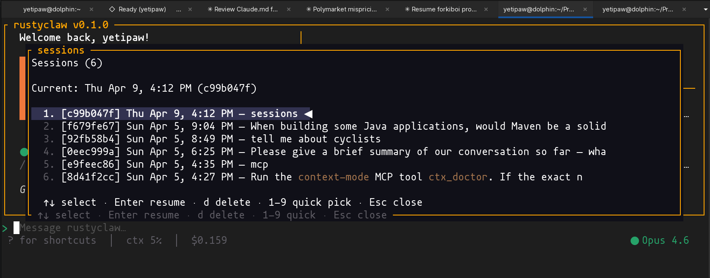

</td>
<td width="50%">

**Interactive help**
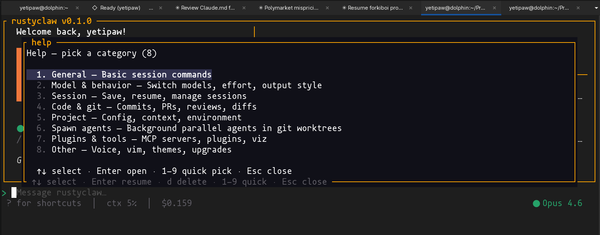

</td>
</tr>
<tr>
<td width="50%">

**Doctor diagnostics**
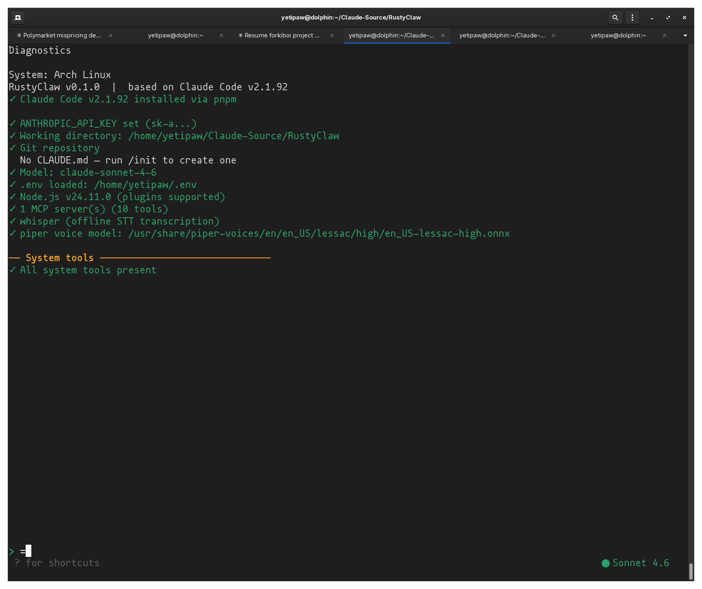

</td>
<td width="50%">

**Cost dashboard**
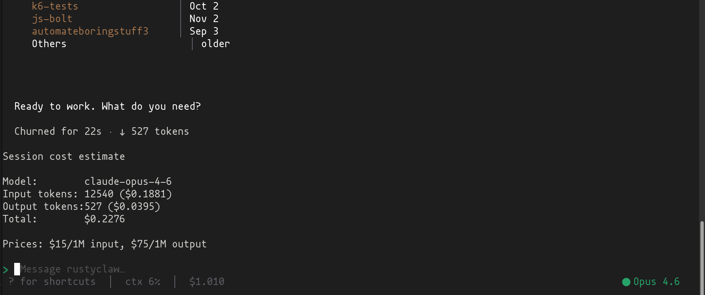

</td>
</tr>
<tr>
<td width="50%">

**Voice I/O — XTTS v2**
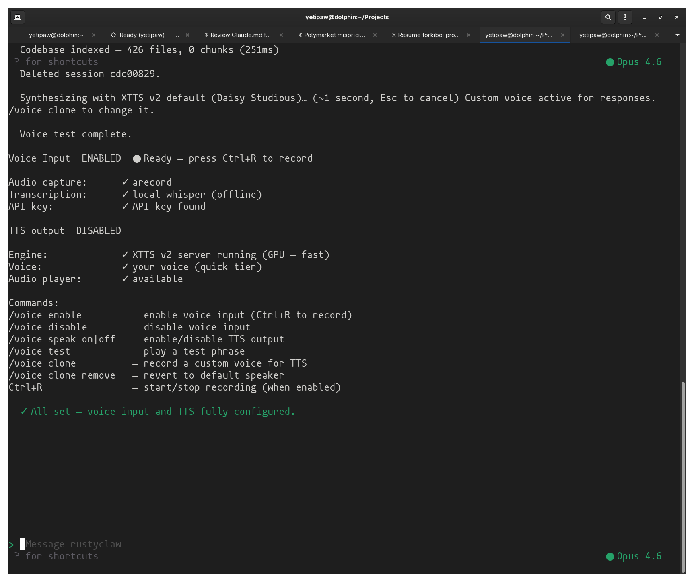

</td>
<td width="50%">

**Keybindings overlay**
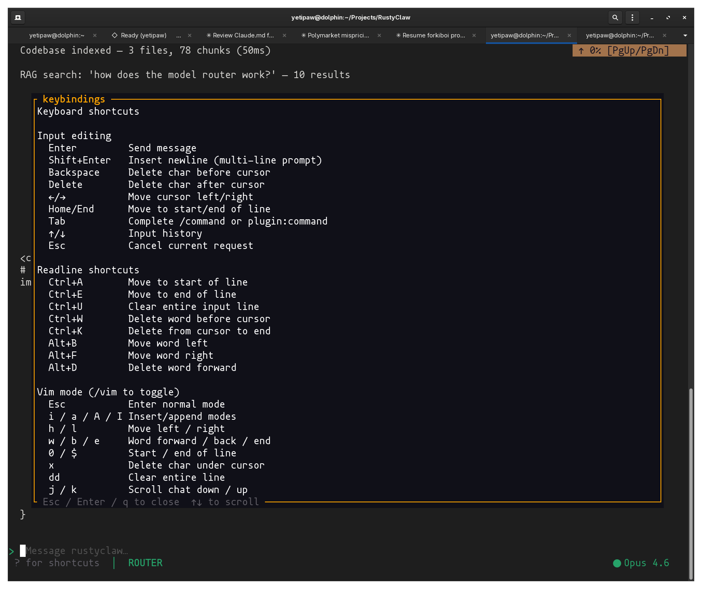

</td>
</tr>
</table>

---

## Install

```bash
curl -fsSL https://raw.githubusercontent.com/ForkedInTime/RustyClaw/main/install.sh | bash
```

<details>
<summary>Other methods</summary>

**From source:**
```bash
git clone https://github.com/ForkedInTime/RustyClaw.git
cd RustyClaw && cargo build --release
./target/release/rustyclaw
```

**Specific version:**
```bash
curl -fsSL https://raw.githubusercontent.com/ForkedInTime/RustyClaw/main/install.sh | bash -s v0.1.0
```
</details>

---

## Why RustyClaw?

| | Claude Code (npm) | RustyClaw |
|---|---|---|
| Runtime | Node.js / Bun | None (native binary) |
| Startup | ~300ms | **~10ms** |
| Memory | ~150MB | **~10MB** |
| Binary | ~50MB JS bundle | **~8MB stripped** |
| Ollama | No | **Built-in** |
| Voice / TTS | No | **XTTS v2 voice cloning** |
| Codebase RAG | No | **tree-sitter + FTS5** |
| Model routing | No | **Auto complexity routing** |
| Cost tracking | No | **Real-time dashboard** |
| Sandbox | No | **bwrap / firejail** |
| SDK / Headless | No | **NDJSON stdio** |

Same Claude API. Same tools. Same CLAUDE.md format. Just faster and self-contained.

---

## Quick Start

```bash
# Set your API key
echo 'ANTHROPIC_API_KEY=sk-ant-...' >> ~/.env

# Run
rustyclaw

# Explore
/help              # interactive command menu
/model             # pick a model (Claude + Ollama)
/doctor            # verify setup
```

`.env` files auto-load from `$CWD/.env`, `~/.env`, or `~/.config/rustyclaw/.env`.

---

## Highlights

- **30+ tools** — Bash, Read, Write, Edit, Glob, Grep, WebFetch, Agent, LSP, Jupyter, MCP plugins, and more
- **60+ slash commands** — `/help`, `/model`, `/session`, `/voice`, `/doctor`, `/rag`, `/budget`, `/reload`
- **Ollama integration** — Local models with automatic tool-use fallback
- **Voice I/O** — Whisper STT + XTTS v2 TTS with voice cloning
- **RAG indexing** — tree-sitter AST parsing, 8 languages, SQLite FTS5 search
- **Smart routing** — Auto-route simple tasks to cheaper models, complex to Opus
- **Cost dashboard** — Real-time token/cost tracking with budget limits (`/budget $5`)
- **260+ spinner verbs** — Video games, medicine, cycling, and general whimsy while you wait
- **SDK mode** — `--headless` NDJSON server for editor/CI embedding ([docs](sdk/))
- **Session management** — Save, resume, search, export conversations
- **Parallel agents** — Spawn background agents in isolated git worktrees
- **Auto-fix loop** — After every Write/Edit, lint + tests run automatically; failures feed back to the model for up to 3 retries. [redacted]-style post-edit feedback, anti-cheat protected.
- **Auto-commit snapshots with `/undo` and `/redo`** — Every assistant turn silently snapshots the working tree to a private shadow ref (`refs/rustyclaw/sessions/<id>`). Navigate history with a picker (`/undo`, `/redo`) or skip straight to a turn (`/undo 3`). Invisible to normal git tooling; never pushed.
- **Sandboxing** — bwrap / firejail / strict isolation
- **XDG compliant** — Respects `$XDG_CONFIG_HOME`, `$XDG_DATA_HOME`, `$XDG_CACHE_HOME`

See **[FEATURES.md](FEATURES.md)** for the full reference.

---

## Documentation

| Document | Description |
|----------|-------------|
| [FEATURES.md](FEATURES.md) | Complete feature reference — every command, shortcut, and config option |
| [sdk/](sdk/) | SDK / headless mode — protocol, examples, integration guide |
| [CHANGELOG.md](CHANGELOG.md) | Release history |
| [CONTRIBUTING.md](CONTRIBUTING.md) | How to contribute |
| [SECURITY.md](SECURITY.md) | Security policy and vulnerability reporting |

---

## License

Apache 2.0 — see [LICENSE](LICENSE).

---

<p align="center">
  <sub>Built on Arch Linux with lots of enthusiasm.</sub>
</p>
