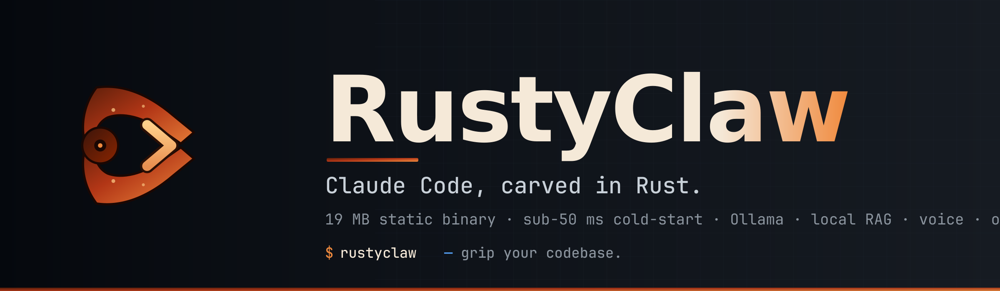
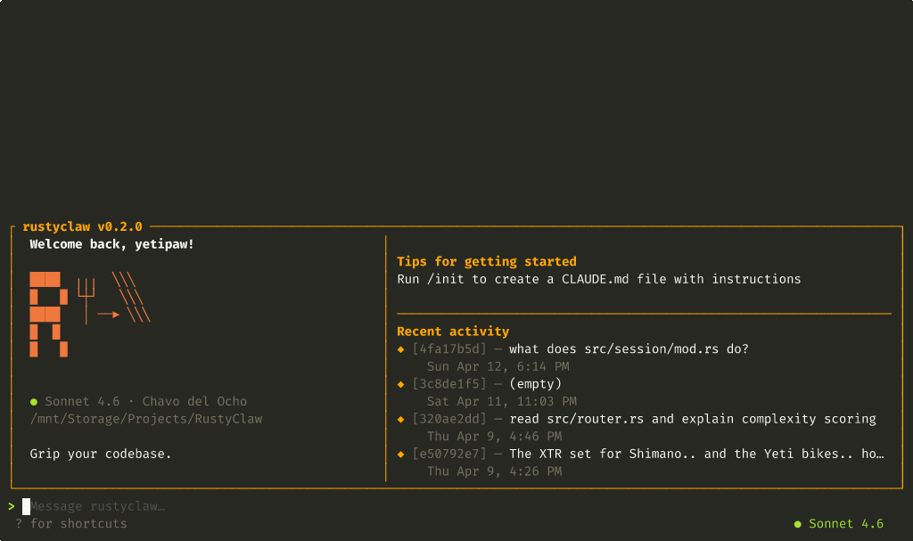

<p align="center">
  
</p>

<p align="center">
  <a href="https://github.com/ForkedInTime/RustyClaw/releases"></a>
  <a href="https://github.com/ForkedInTime/RustyClaw/actions/workflows/ci.yml"></a>
  <a href="LICENSE"></a>
  <a href="https://www.rust-lang.org"></a>
  <a href="https://github.com/ForkedInTime/RustyClaw/stargazers"></a>
</p>

<h3 align="center">The Claude Code experience — native, offline-capable, and in a single 19 MB binary.</h3>

<p align="center">
  No Node. No Python. No 80 MB of <code>node_modules</code>. No flickering TUI.<br>
  Indexes your codebase, routes each task to the cheapest capable model, and runs agents in parallel.
</p>

<p align="center">
  
</p>

---

## Install

```bash
curl -fsSL https://raw.githubusercontent.com/ForkedInTime/RustyClaw/main/install.sh | bash
```

<details>
<summary>Other install methods</summary>

**From source (Rust 2024 edition):**
```bash
git clone https://github.com/ForkedInTime/RustyClaw.git
cd RustyClaw && cargo build --release
./target/release/rustyclaw
```

**Specific version:**
```bash
curl -fsSL https://raw.githubusercontent.com/ForkedInTime/RustyClaw/main/install.sh | bash -s v0.2.0
```

Pre-built binaries for `x86_64-linux-gnu`, `aarch64-linux-gnu`, and `x86_64-linux-musl` are attached to every [release](https://github.com/ForkedInTime/RustyClaw/releases).
</details>

```bash
echo 'ANTHROPIC_API_KEY=sk-ant-...' >> ~/.env
rustyclaw
```

---

## Why RustyClaw?

> **Every other "Rust port" of Claude Code re-implements the CLI and stops there.**
> RustyClaw takes the Rust advantage and builds the features a native binary makes possible — an on-disk codebase index, a smart router that keeps your bill down, parallel agents in git worktrees, voice I/O, and a `/undo` that actually works.

|  | Claude Code (npm) | [Claurst](https://github.com/Kuberwastaken/claurst) | **RustyClaw** |
|---|---|---|---|
| Runtime | Node.js / Bun | Rust | **Rust** |
| Binary | ~50 MB + `node_modules` | ~15 MB | **19 MB static, zero deps** |
| Cold start | ~300 ms | ~50 ms | **sub-50 ms** |
| Memory idle | ~150 MB | ~40 MB | **~10 MB** |
| Ollama tool-use | No | [Broken (#42)](https://github.com/Kuberwastaken/claurst/issues/42) | **Working** |
| Codebase RAG | No | No | **tree-sitter + FTS5, 8 langs** |
| Model router | No | No | **Auto-route by task complexity** |
| Parallel agents | No | No | **Git-worktree isolation** |
| Voice I/O | No | No | **Whisper + XTTS v2 cloning** |
| Auto-fix loop | No | No | **Post-edit lint + tests + retry** |
| `/undo` · `/redo` | No | Partial (pollutes git log) | **Invisible shadow refs** |
| OpenAI-compat providers | No | Partial | **9 providers, working tools** |
| Sandbox | No | No | **bwrap / firejail / strict** |
| CLAUDE.md + AGENTS.md | Partial | No | **Both, with `/reload`** |

---

## Feature tour

### 🧠 &nbsp; Local codebase RAG — zero setup

tree-sitter AST parsing, SQLite FTS5 semantic search. Index your whole repo in seconds. Indexes stay on disk and update incrementally.

```
> /rag search "TOCTOU"
HAS match "search TOCTOU" — 10 results
  src/tools/read.rs:12 (module `search`, rust)
  src/session/mod.rs:17 (comment, rust)
  ...
```

### 💰 &nbsp; Smart model router + live cost dashboard

Simple edits go to Haiku or Ollama. Architecture questions go to Opus. Every token is priced in real time. Cap the bill with `/budget $5` — RustyClaw refuses to go over.

### 🎭 &nbsp; Parallel agents in git worktrees

```bash
rustyclaw spawn "refactor the auth middleware"
# runs in an isolated git worktree while you keep working in the main tree
```

### 🎤 &nbsp; Voice I/O with XTTS v2 cloning

Push-to-talk speech input (Whisper). TTS responses in any voice, including a clone of your own after a 6-second sample. **No competitor ships this.**

### ♻️ &nbsp; Auto-fix loop — Aider-style, anti-cheat protected

Every `Write`/`Edit` kicks off a lint + test cycle. Failures feed back into the next turn for up to three retries. The old rollback-on-fail behaviour is gone — RustyClaw fixes forward.

### ↩️ &nbsp; `/undo` and `/redo` on shadow refs

Every assistant turn silently snapshots the working tree to `refs/rustyclaw/sessions/<id>/<n>`. Invisible to `git log`, `git branch`, `git status`. Never pushed. Use the `/undo` picker or skip straight to a turn with `/undo 3`. **Aider has undo; it pollutes your history. RustyClaw doesn't.**

### 🔌 &nbsp; Works offline via Ollama — with working tool use

Full tool use over Ollama's native format — Claurst's issue #42 is where we started. Auto-falls back to prompt-injected JSON on models that don't support native tools.

### 🦀 &nbsp; Single 19 MB static binary

No runtime. No dependencies. No post-install scripts. `scp` it to a server and run. Cross-compiled for `x86_64-linux-gnu`, `aarch64-linux-gnu`, and `x86_64-linux-musl` on every release.

### 🛡️ &nbsp; Sandbox-first execution

Shell commands can run under `bwrap`, `firejail`, or a `strict` mode (no network, read-only FS). Approvals are per-session, per-command-family.

### 📁 &nbsp; Respects your config like a native tool

XDG Base Directory compliant (`$XDG_CONFIG_HOME/rustyclaw`, `$XDG_DATA_HOME`, `$XDG_CACHE_HOME`). Reads **both** `CLAUDE.md` and `AGENTS.md` (3,518 upvotes on the Claude Code repo). Hot-reload with `/reload` — no restart.

See **[FEATURES.md](FEATURES.md)** for the complete reference (30+ tools, 60+ slash commands, every config knob).

---

## Quick start

```bash
# First-run setup
rustyclaw /init         # generates CLAUDE.md from your repo
rustyclaw /doctor       # verifies API keys, models, and sandbox

# Day-to-day
rustyclaw               # interactive TUI
rustyclaw --headless    # NDJSON stdio for editor/CI embedding (see sdk/)

# Inside the TUI
/help                   # interactive command menu
/model                  # pick a model (Claude + Ollama + 9 OpenAI-compat providers)
/rag search <query>     # semantic codebase search
/budget $5              # cap the bill
/voice                  # voice I/O + TTS picker
/spawn <task>           # parallel agent in a git worktree
/undo                   # step back to any previous turn
```

`.env` files auto-load from `$CWD/.env`, `~/.env`, or `~/.config/rustyclaw/.env`.

---

## What it looks like

<details open>
<summary>Screenshots</summary>
<br>
<table>
<tr>
<td width="50%">

**Streaming codebase conversation**


</td>
<td width="50%">

**Completed response with cost tracking**


</td>
</tr>
<tr>
<td width="50%">

**Codebase RAG search**


</td>
<td width="50%">

**Model picker — Claude + Ollama + OpenAI-compat**


</td>
</tr>
<tr>
<td width="50%">

**Session manager**


</td>
<td width="50%">

**Interactive help**


</td>
</tr>
<tr>
<td width="50%">

**Doctor diagnostics**


</td>
<td width="50%">

**Cost dashboard**


</td>
</tr>
<tr>
<td width="50%">

**Voice I/O — XTTS v2**


</td>
<td width="50%">

**Keybindings overlay**


</td>
</tr>
</table>
</details>

---

## Documentation

| Document | Description |
|----------|-------------|
| [FEATURES.md](FEATURES.md) | Complete feature reference — every command, shortcut, and config option |
| [sdk/](sdk/) | SDK / headless mode — protocol, examples, integration guide |
| [CHANGELOG.md](CHANGELOG.md) | Release history |
| [CONTRIBUTING.md](CONTRIBUTING.md) | How to contribute |
| [SECURITY.md](SECURITY.md) | Security policy and vulnerability reporting |

---

## License

Apache 2.0 — see [LICENSE](LICENSE).

---

<p align="center">
  <br>
  <sub>Built on Arch Linux. No rust was harmed in the making of this binary.</sub>
</p>
